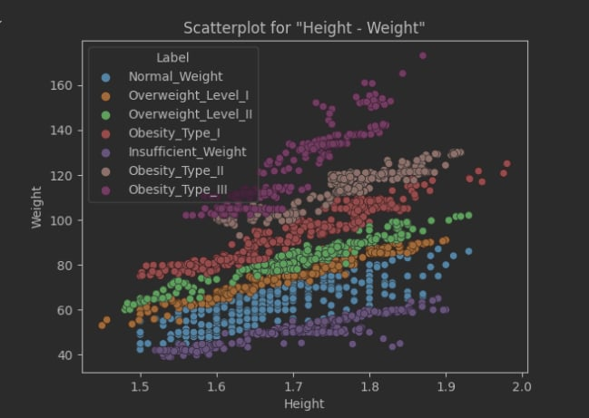
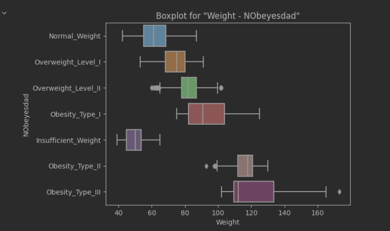
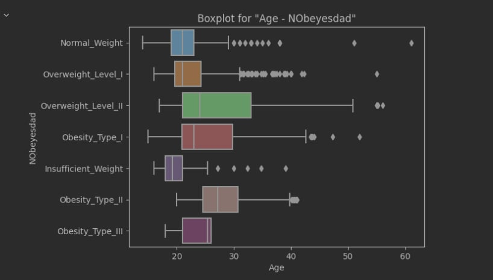
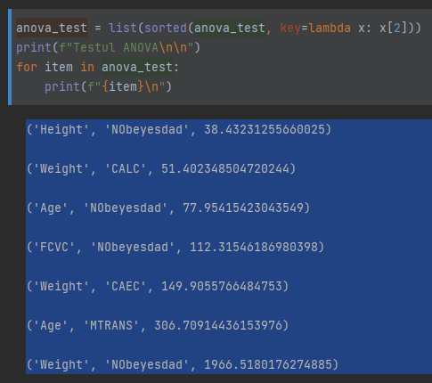

# Homework 1

## Setup

In order to perform the setup, the following commands need to be run:

```sh
$ python -m venv venv
$ source ./venv/bin/activate
$ pip install -r ./requirements.txt
```

Or just:

```sh
$ source ./setup.sh
```

After this, the environment should have the dependencies set up.

## Running

The code can be run using VSCode + [Jupyter](https://marketplace.visualstudio.com/items?itemName=ms-toolsai.jupyter). Each cell can be run individually directly from the user interface.

## What this repo contains

This repository contains statistics and charts on dataset for obesity. Here we performed univariate and multivariate analysis.

From the univariate analysis we can obtain the following details:
1. Age is leptokurtic and right skewed. This indicates that our dataset is quite targeted on a younger population.
1. Height and weight are mesokurtic and symmetric. This indicates that our dataset has a wide variation in its data.
1. Many of the surveyed individuals in the available dataset already present a family member that face this issue in their family, thus indicating that this also might be based on genetics.
1. Many of the surveyed individuals are frequently consuming high-caloric foods.

From the multivariate analysis we can obtain the following:
1. Based on scatter-plots (screenshot #1 below) and boxplots (screenshot #2, #3 below), the attributes with the highest prediction power are:
    1. Height
    1. Weight
    1. Age
1. Based on the ANOVA score (screenshot #4 below), we could also observe that FCVC (Frequency of consumption of vegetables) is inversely correlated with obesity, thus vegetarians _might_ be on the normal weight category.
1. Many of the surveyed individuals that consume foods with high calories don't smoke.
1. Many of the surveyed individuals that consume foods with high calories don't monitor their calories intake.

## Screenshots

### Screenshot #1: Scatter-plot based on height, weight, and obesity prediction

* The scatter plot displays that using Height and Weight, the data could be easily separable



### Screenshot #2: Boxplot based on weight and obesity prediction

* The boxplot shows that label variable separates the numerical attribute Weight quite well.



### Screenshot #3: Boxplot based on age and obesity prediction

* This boxplot helps us separate Obesity_Type_II and Obesity_Type_III using the Age attribute. Separating these 2 classes using just Weight attribute is more dificult.



### Screenshot #4: ANOVA score 

* The ANOVA test confirm what the plots above show us in regards to the Weight, Height and Age variables. Also, it shows that FCVC also has a good predictive power.


